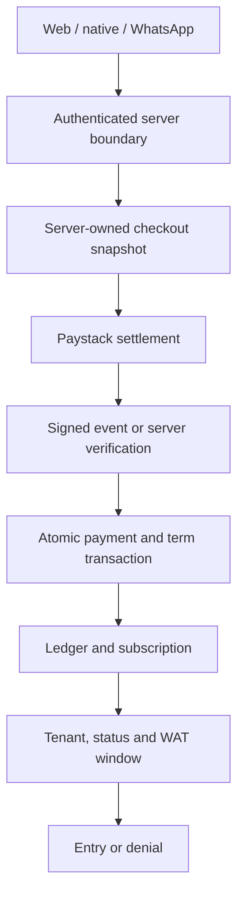

> **Follow-up, 2 October 2026:** This document preserves the original critical audit. The approved remediation is described in [the release notes](2026-10-02-release.md); [the issue register](2026-10-01-issues.csv) now records the fixes and remaining verification. Original open-status statements below describe the audited baseline.

# GymFlow critical prelaunch audit

**Audit date:** 1 October 2026 (UTC; membership calendar Africa/Lagos / WAT).  
**Repository:** zitch-systems/Gymflow. Baseline: `1d51bf7ed83e5d7679e6f47946e6883359b31653`.  
**Production observed:** https://www.gymflow.ng, Vercel deployment `dpl_2k3u4ybo4uAfFWzBYxeNrk46mngQ`, matching the baseline.  
**Review branch:** `audit/gymflow-prelaunch-20261001`; [draft PR #245](https://github.com/zitch-systems/Gymflow/pull/245). All remediations described as local are proposals, not production changes.

## 🔴 NOT READY FOR PRODUCTION

GymFlow has material launch blockers. A compromised staff/platform password can bypass its custom email second-factor flow at the Supabase authorization boundary. Cash payment recording and access extension remain separate operations, so the dominant front-desk payment path can still leave a paid member without access after a failure. Recovery of production data, Auth and Storage has not been rehearsed or verified.

The review recorded **49 findings: 9 P0, 31 P1 and 9 P2**. **23 have verified local remediations**, **23 remain open**, and **3 require production verification**. Seven of the nine P0 findings have local remediations; the MFA boundary and cash transaction remain unresolved. None of these fixes has been merged or deployed by this audit. Related symptoms are grouped so the register does not count every affected screen as a separate vulnerability.

The final local suite passes **979 tests in 67 files**, with no skipped tests, plus lint, web/test TypeScript, a Next.js production build and the frozen root dependency install. The root production dependency audit now reports zero known findings. Mobile still has four high advisories and the Meta connector one high advisory; a zero-critical result is not a clean audit of those applications.

The highest reputation risk is a member being charged, told they are renewed, and then refused entry. The baseline can produce that outcome through non-atomic fulfillment, first recurring enrollment, incompatible payment channels, missing/rejected webhooks and cash-operation failures. The patch closes several of these paths, but the remaining cash, recovery and operational gaps prevent a readiness claim.

## Scope, evidence and limitations

The requested adversarial brief was applied to the actual repository rather than an assumed design. Work covered web routes/server actions, native member APIs and Expo app, membership/payment/check-in state machines, migrations/RLS/RPCs, WhatsApp identity and AI tools, exports, backup jobs, scheduled reconciliation, deployment configuration and dependencies. GPT 5.6 Sol handled bounded security-code extraction, UX/native checks, dependency/operations work and the disposable database setup; the primary review integrated and verified the critical conclusions.

Evidence labels have distinct meanings:

| Label | Meaning |
| --- | --- |
| Confirmed statically | A reachable code/data-flow or schema defect is established in the reviewed source. This is not a claim that a live exploit was executed. |
| Verified locally | A change passed the stated checks against the proposed branch. Database behavior used the real PostgreSQL RLS/constraint/transaction engine. |
| Observed live | A read-only deployment, public route, browser or operational metadata observation. |
| Production verification required | Live configuration/data or an authenticated/provider/device journey could not be inspected or exercised. |

No customer records, production schema, provider mandates, real payment, email delivery, backup delivery or production deployment were changed. Destructive and concurrency probes used synthetic fixtures in a disposable PostgreSQL 17.6 database. Supabase-shaped Auth/Storage prerequisites and a narrow SQL transport adapter were used where needed; these tests do not exercise GoTrue, PostgREST HTTP, Supabase Storage HTTP or Paystack itself. The temporary native PostgreSQL launch binaries were adjusted to run in this container's root-only namespace; SQL, locking and RLS engine behavior was retained. They are test infrastructure and are not part of the application patch.

The connected Supabase account exposed other projects, not GymFlow. Consequently the current live migration ledger, data anomalies, grants, Auth/MFA settings, Storage policies, backup/PITR state and advisors could not be inspected. This is an evidence gap, not proof that those settings are insecure or absent. No credentials were requested or printed.

Historical CI evidence is useful but bounded: [Actions run 35914756634](https://github.com/zitch-systems/Gymflow/actions/runs/35914756634) completed verify → live migration/fingerprint check → production deploy on 23 September at the baseline. That does not prove current data correctness, object recovery or policy settings. The fingerprint covers public/private structure and policy/function bodies; it is not a complete fingerprint of Auth configuration, Storage objects/policies, table ACLs and CHECK constraints.

The public site and listed public/auth/PWA resources responded successfully; signed-out protected routes redirected to sign-in. A seven-day Vercel error query returned no clusters. Neither observation proves successful authenticated business journeys or scheduled work.

## Architecture and authority

| Component | Actual role and boundary |
| --- | --- |
| Next.js App Router on Vercel | Public pages, tenant subdomain resolution, member/staff/coach/platform consoles, server actions, native APIs, provider webhooks and cron endpoints. Baseline lock graphs differed; proposed root runtime is Next 16.3.8. |
| Supabase Auth | Password, signup, reset and session issuance. Web uses host-scoped cookies; native uses bearer JWTs held in device secure storage. Custom email challenges live in app tables and do not themselves create an AAL2 JWT. |
| PostgreSQL / Supabase RLS | Tenant and role enforcement. Staff/member links are authorization facts; service-role code bypasses RLS and must bind identity/tenant server-side. |
| `member_subscriptions` | Current membership state/paid coverage window. One live row per member/gym is enforced by a partial unique index. |
| `memberships` | Compatibility mirror, synchronized bidirectionally through triggers. It is another write surface that must preserve the same invariant. |
| `payments` / `platform_payments` | Member-to-gym and gym-to-GymFlow money ledgers. Provider transaction reference is unique; offline receipts use MANUAL references. A money row alone was not proof that entitlement committed. |
| Paystack | External authority for charge settlement, recurring mandates, refunds/disputes, splits and payout transfer outcomes. Browser redirects are only triggers for server verification. |
| Check-in tables | `check_ins` contains visits with a unique open visit per member/gym. `checkin_codes` contains short-lived member-generated front-desk codes. |
| Storage | Public gym raster assets and private tenant ZIP exports. Database backups preserve object metadata, not the uploaded object bytes. |
| WhatsApp/Meta | HMAC-verified inbound messages, encrypted Flow exchanges, server-bound contact/gym identity, payment links and confirmations. |
| AI assistant | Read-only allowlisted tools bound to authenticated contact/member/gym. No model-controlled tenant/member identifiers or independent financial/access overrides found. |
| Resend/Sentry | Notification and external error channels. Neither should be the transactional authority or sole durable record of a money incident. |
| Expo mobile / Meta connector | Independently locked applications; they are not covered by the root application's CI graph. |

The authority is a chain of verified facts, not one front-end flag: Paystack proves external settlement; a server-owned sale specifies the paid amount and term; PostgreSQL commits the ledger and allocation; the current tenant link, gym state, membership status and paid calendar window determine entry. A notification or `Active` badge is a read model of those facts.

This diagram describes the proposed member Paystack path. Cash and platform billing require their own review; the atomic member RPC does not automatically make every financial flow atomic.

### Roles and data visibility

| Principal | Permitted scope in reviewed design | Important restriction / remaining question |
| --- | --- | --- |
| Anonymous | Public gym/onboarding/marketing data and public assets | No member financial/private tables; raw privileged RPC calls denied. Public member code is not an authorization secret. |
| Member | Own active gym links, own coverage/payments/visits/bookings, permitted gym plans/schedules and own profile fields | Cannot self-grant staff/platform role, alter paid term or another member's visit. A member can legitimately belong to more than one gym. |
| Owner / gym_owner | Own gym operational management and owner billing/settings | No other tenant through ordinary RLS; staff-factor protection is currently bypassable. |
| Manager | Own gym delegated management | Manager/platform promotion boundaries have explicit guards and passing local tests. |
| Front desk | Own gym members, attendance and authorized manual operations | Current administrative action allowlist also allows sensitive manual renewal/payment actions; require receipt/reason traceability. |
| Accountant | Own gym financial/administrative operations allowed by ADMIN_ROLES | Purpose-based limits for profile health notes and membership overrides need an explicit policy. |
| Instructor / coach | Assigned/own class and training/member workflows | Instructor is not a general admin actor; sampled actions separate coach vs console permissions. |
| Platform admin | Platform operations across gyms | Privileged authorization requires active platform-admin row but no DB-enforced native second factor. |
| Service role | Backend/webhooks/jobs; bypasses tenant RLS | Never a client credential. Every service writer must independently bind tenant/member and validate source. |

Row visibility is not field minimization. `profiles` includes health notes and emergency details behind a row-scoped visibility helper; tenant isolation alone does not decide whether an accountant or instructor should receive every sensitive column. GF-046 records this product/security decision.

### Business states

| Entity | Stored / observed states | Effective interpretation |
| --- | --- | --- |
| Gym | active, trial, suspended, terminated | Online/offline gym status is separate from platform feature/tier entitlements. |
| Member link | active/inactive | Tenant association; inactive link must deny new entry. It does not prove payment. |
| Membership | active, past_due, paused, pause_requested, cancelled, expired | active/past_due permit entry only inside the paid start/end window. Pauses and cancellation must not be undone by billing events. |
| Display state | active, scheduled, expired, frozen, freeze_pending | Proposed shared member read model includes start date and WAT final day. Staff screens are not yet fully consistent. |
| Money | success/successful, pending/other provider states, refunded | Only verified successful settlement grants paid term. Pending/failed/refunded are not interchangeable. |
| Recurring mandate | enabled/bound codes vs disabled/ended/dunning | A billing mandate is not a membership or proof that a cycle was paid. |
| Visit | active open → completed/closed | Exactly one open visit per member/gym; checkout must remain possible after midnight/expiry. |
| Front-desk code | live, expired, used | Ten-minute capability; bound to member/gym; not a reusable entitlement. |

Date-only `start_date` and `end_date` are calendar days. Proposed entry rule: active tenant link, online gym, status active/past_due, and **start_date ≤ WAT today ≤ end_date**. Final-day messaging now agrees with this inclusive rule. GF-018 remains open because initial `+N` period arithmetic can award N+1 inclusive dates and the monthly overflow policy is not specified as a product contract.

## Critical membership integrity report

| Mandatory question | Answer based on this audit |
| --- | --- |
| Can GymFlow incorrectly say a paid member is expired? | **Yes at baseline, and some pathways remain.** Final-day midnight UI mismatch is fixed locally. First recurring failures, payment-channel rejection and non-atomic Paystack fulfillment are fixed locally. Cash crash/retry, missing or permanently rejected provider events, stale native data, and inconsistent staff past_due/history read models remain. A membership can also be credited correctly while a tenant/platform-feature gate blocks the app; that requires accurate explanatory copy rather than an Expired label. |
| Can unpaid/expired members gain access? | **Yes under identified exceptional paths.** Future-start entry and dunning that resumes a freeze are fixed locally. Staff can intentionally grant term under their permissions; complimentary/manual overrides need a reason and audit allocation. Refunded term currently remains active unless an operator intervenes. Initial-day arithmetic may overgrant one date. Ordinary expired-member entry is denied by the tested proposed DB window. |
| Can membership activate twice? | One live-row constraint prevents two active rows for the same member/gym under the proposed schema. It does not prevent two independent manual operation keys or duplicate provider mandates. Activation must be distinguished from stacking two genuinely different paid purchases. |
| Can membership extend twice? | A new Paystack reference is settled once atomically; simultaneous webhook/callback on that reference buys one period. Two distinct verified payments correctly buy two periods. Manual retry uses a fresh reference and can still extend twice. |
| Can payment be recorded twice? | Same provider reference cannot produce two ledger rows. Two MANUAL references for one receipt can. A unique provider reference alone did not guarantee the corresponding term existed at baseline. |
| Can a member have overlapping memberships? | The unique live index prevents multiple active/past_due/paused/pause_requested rows per member/gym. Different gyms are legitimate. Historical cancelled/expired dates can overlap, and mirrored tables must remain synchronized. Live data overlap cannot be ruled out without current DB inspection. |
| Can staff manipulate membership status? | Authorized tenant staff can grant, suspend, freeze or renew through permitted operations/RLS. They cannot promote themselves or write another tenant in sampled local tests. Broad manual powers and incomplete old/new/reason/receipt audit remain concerns; a stolen privileged password bypasses the custom second factor. |
| Can members manipulate membership status? | Direct member writes to privileged membership state and role escalation are denied in local RLS tests. Member profile/check-out actions have narrower validators. Public Paystack metadata must not be accepted as server sale authority; the proposed snapshot/RPC closes that path. |
| Can simultaneous requests produce an incorrect state? | Proposed Paystack settlement serializes same-reference and same-member term updates; rollback/concurrency tests pass. Freeze/dunning protection is improved. Manual receipt retries, first auto-renew mandate creation and other last-write-wins administrative edits still require transactional operation keys/state versioning. |

The compatibility mirror, tenant-link status, paid date, display state and recurring flag must not be treated as independent authorities. The proposed patch improves member views and DB entry gates, but staff dashboard counts and some historical-row selection remain GF-048.

## Critical payment integrity report

| Mandatory question | Answer based on this audit |
| --- | --- |
| Can a successful payment fail to activate membership? | **Yes.** Baseline crash gap, invalid ledger channel and first recurring enrollment are reproduced/verified locally and remediated. Cash split operations remain. An inactive link, deleted/invalid plan, conflicting mandate, metadata-less unresolvable initial event, unavailable service configuration, or a missed event can require manual reconciliation. Taking payment is not evidence that access committed. |
| Can one payment activate membership twice? | New provider reference path: duplicate requests return committed fulfillment without another period; tested concurrently. Old non-atomic/orphan rows require reconciliation, not blind replay. Manual receipt duplication remains possible. |
| Can an unpaid transaction activate membership? | Pending/failed browser responses do not enter successful fulfillment; invalid signatures fail closed. Wrong amount/currency/reference/tenant is denied by the proposed RPC. Staff may deliberately assign/renew without a corresponding paid ledger row; that must be an explicit audited override, not an implied successful receipt. |
| Can the amount be manipulated? | Metadata alone was insufficient authority at baseline. Proposed service-owned reference fixes price/term/currency, including checkout opened before a staff edit. Recurring later cycles validate provider plan amount/currency and use its interval. Actual provider sandbox verification remains required. |
| Can a reference be reused? | Same reference is locked and checked against member/gym/plan/amount/currency, then returns one committed outcome. Cross-charge reuse, refunded replay and pre-atomic legacy rows are rejected/reconciled. Client cash retries currently mint a different reference. |
| Can a webhook be replayed? | HMAC authenticates origin, not freshness. Body-hash ledger and per-reference transaction make charge replay harmless under tested local cases. Lifecycle-event ledger is best-effort and concurrent/status-ordering cases are not fully closed. |
| Can a missing webhook leave a legitimate member inactive? | **Yes if the callback is not reached or cannot fulfill.** Verified callback backstop now dispatches member auto-renew correctly. Closing the browser plus a missing webhook still depends on reconciliation; current sweep is capped, 48 hours, human repair only and lacks a durable incident queue/SLA. |
| Can a refund leave membership active incorrectly? | **Yes under the current deliberate policy.** Refund handler updates money status without term reversal. Whether access retention is goodwill or unauthorized must be encoded per refund allocation; full/partial/refund-before-charge cases need tests. Do not blindly delete all coverage because another valid purchase may remain. |

The new `member_payment_checkouts` snapshot table and `settle_member_charge` function are service-only; anon/authenticated reservation/settlement attempts are denied by real DB tests. Settlement writes fulfillment version, subscription ID, paid term and committed end date on the money row. If the payment write fails after term computation, the whole transaction rolls back. It must be deployed before code that invokes it.

Legacy ledger rows are not silently assumed fulfilled. The patch raises a reconciliation requirement rather than claiming success solely because a row exists. Before release, build an operator-reviewed list of affected historical references, verify each directly with Paystack, compare the actual granted term, and apply a bounded idempotent correction. Do not blanket-delete/replay customer payments.

## Critical check-in report

| Mandatory question | Answer based on this audit |
| --- | --- |
| Can a valid member be denied incorrectly? | **Yes through money-state inconsistencies, stale UI, offline access, or infrastructure/provider failures.** Final-day messaging, future window, paid past_due staff gate and overnight lookup are improved locally. Cash/reconciliation and staff display remain. |
| Can an expired member gain access? | Proposed DB triggers reject expired dates/status, inactive links, future starts and offline gyms for member/staff/service inserts. Refund-retained or intentionally overridden coverage is a separate business-policy gap. Checkout of an existing visit is allowed without granting another entry. |
| Can the same member check in twice accidentally? | Unique-open index leaves one open visit. Concurrent tests prove one row; member/manual staff/WhatsApp recovery returns already-in after a duplicate insert race. A completed visit may legitimately be followed by re-entry. Some code-redemption error paths still need friendlier retry handling. |
| Can a member check in as another member? | Local RLS/code validators reject other-member/other-gym writes. WhatsApp identity is server-bound and member/code issuance scopes are checked. Real code/QR sharing, physical presence and staff social-engineering are not solved by row scoping; a signed gym QR is not a geofence. |
| Can staff manipulate attendance? | Staff can record approved manual attendance for their own gym; this is an intentional operational power. Actor/reason/immutable history should make exceptions reviewable. Sampled tenant and field-mutation tests block cross-gym and member rewriting. |
| Can two staff create inconsistent check-ins? | The one-open-row invariant holds under concurrent DB inserts. A losing request may need to re-read state rather than show a raw constraint error. Transactional code redemption/visit creation and coordinated retry UX should be exercised over HTTP. |

Entry is enforced in the DB even for service-role WhatsApp inserts; backend bypass of RLS is not bypass of the new entitlement trigger. Offline operation fails closed; no secure cached offline admission policy was verified.

## Edge-case matrix

“Local pass” below names tested state/logic, not a production browser journey. “Pending” is an acceptance test that has not been executed.

| Scenario | Authentication/onboarding | Payment/renewal | Check-in/membership | Residual severity |
| --- | --- | --- | --- | --- |
| Normal operation | Public auth UI observed; native compiles; authenticated signup/email pending | Local atomic first/renewing/recurring cases pass; provider checkout pending | Local valid member/staff/service entry passes | P1 live journey gap |
| Duplicate request | OTP consume race open | Same provider reference local pass; cash operation key open | Unique open visit local pass; main handlers recover | P1/P2 |
| Refresh | Session route/source checks; live authenticated refresh pending | Callback can retry verified charge; must never initialize another charge automatically | Read persisted visit/state | P1 cash/recovery |
| Back button | Public tab/navigation observed; role/device journey pending | Do not imply payment success or offer repay after settled-but-unapplied result | Persisted open visit should re-render | P2 validation gap |
| Network failure | Native stale/error behavior needs visible timestamp/banner | Transient DB failures must remain retryable; init timeout/duplicate-mandate reservation open | Fail closed; supervised outage procedure required | P1 |
| Timeout | Root/device timeout journey pending | Snapshot remains; webhook/callback can reconcile, but queue/SLA incomplete | No fake entry success; show retry/last-known state | P1 |
| Concurrent requests | OTP counter race remains | Same/different reference local pass; cash/auto-init open | Two writes leave one open row; freeze lifecycle tests pass | P0 cash/P1 auto-init |
| Expired session | Protected public redirects observed; bearer helpers verify user | Financial credit belongs to verified payer, independent of viewing account | RLS must deny unauthorized mutation | P1 privileged MFA/session evidence |
| Invalid input | Validation reviewed; OTP/form edge device tests pending | Wrong currency/amount/tenant/reference denied locally | Future/expired/paused/inactive denied locally | Closed tested cases; untested APIs bounded |
| Unauthorized request | Direct second-factor bypass confirmed statically | Service-only settlement/reservation denied to anon/member | Cross-member/gym writes denied locally | P0 MFA |
| Duplicate webhook | HMAC/ledger helpers local pass | One committed payment and term locally | Courtesy notifications must not drive state | P1 lifecycle/notification ordering |
| Delayed webhook | No general factor implication | Callback backstop; browser closed relies on capped reconciliation | Member may remain denied until correction | P1 |
| External service failure | Supabase/Resend signup/factor availability not rehearsed | Paystack outage: no verified charge, no new paid term; duplicate initialization needs reservation | Existing paid access needs DB/network; offline policy absent | P1 |

## Security attack matrix

| Attack | Tested / inspected | Result | Severity / remaining work |
| --- | --- | --- | --- |
| IDOR | Real RLS tenant/member reads/writes, native bearer scoping, sampled actions | Sampled negatives pass; all service writers still require bound scope | P0 MFA can unlock existing privileged rights; live HTTP matrix pending |
| XSS | React rendering, JSON-LD escaping, CSV escaping, raw Storage MIME | No confirmed app-origin injection found in sampled paths; SVG bucket mismatch fixed locally | P2 raw upload and dynamic browser tests pending |
| SQL injection | UUID/filter validation, parameterized DB cases, escaped roster filters | No confirmed injected SQL path in reviewed application calls | Broad dynamic/API fuzzing pending |
| CSRF | Next server-action origin boundary; cookie vs native bearer APIs | No confirmed write CSRF found in sampled routes; permissive native CORS is not authorization | Real cross-origin session tests pending |
| SSRF | Request-origin allowlist, image/storage URL surfaces and source review | No confirmed SSRF exploit; allowed remote images still depend on patched runtime | Live image redirect/private-address tests pending |
| Privilege escalation | Staff/platform link and profile mutation DB suites | Self/manager escalation blocked in sampled cases | P0 direct Auth bypass of promised factor remains |
| Tenant bypass | Cross-gym DB suite, WhatsApp sign-in data flow | Ordinary sampled RLS isolation passes; unintended WhatsApp enrollment fixed locally | Storage and multi-role live tenant tests pending |
| Session attack | Host-scoped callback/session paths, bearer verification | Password-only AAL1 privileged DB access remains possible; device/logout invalidation not fully exercised | P0 |
| Rate-limit bypass | Rate-limit RPC tests and source | Counter primitive passes; limiter intentionally fails open on backend/config error | P2 OTP concurrency; verify edge IP trust and production thresholds |
| Payment manipulation | Real settlement wrong amount/currency/member tests; signed verification route | Proposed snapshot fails closed; baseline authority gap fixed locally | P0 cash transaction and historical reconciliation |
| Webhook replay | HMAC/body-hash helpers and concurrent reference tests | Charge replay cannot double-credit in proposed path | P1 lifecycle ordering/ledger outage and durable poison-event recovery |
| File upload attack | Raster action allowlist, bucket migration review | SVG mismatch fixed locally; size/MIME controls reviewed | P1 live tenant Storage policies unknown; malware/private upload HTTP tests pending |
| Open redirect | `originForHost` and redirect/request-origin tests | Foreign callback host rejected/falls back in tested cases | Real proxy-header/custom-domain journey pending |
| AI tool abuse/prompt injection | Server-bound read-only tool registry and identity paths | No model-controlled money/access write path found; backend remains authority | Adversarial prompt suite/LLM live behavior pending |

A passing local table test cannot validate a dashboard-created live Storage policy, an actual JWT refresh/revocation path or third-party webhook delivery. The security report separates these facts explicitly.

## Busy-gym and growth assessment

Synthetic local SQL fixtures were created and removed in the disposable database. A representative broad tenant-scoped roster name query and a current entitlement lookup were measured with `EXPLAIN ANALYZE`; these are not the complete production HTTP queries or page-render latency. The actual roster search also has trigram indexes and a 500-match cap that needs visible completeness handling.

| Synthetic members in one gym | Broad roster query, execution ms | Entitlement lookup, execution ms | Production dashboard/report/HTTP response |
| --- | ---: | ---: | --- |
| 100 | 5.145 | 0.048 | Not measured |
| 500 | 14.845 | 0.042 | Not measured |
| 1,000 | 29.330 | 0.045 | Not measured |
| 5,000 | 149.744 | 0.047 | Not measured |
| 10,000 | 303.697 | 0.053 | Not measured |

A burst of 1,000 distinct local check-in inserts using eight DB connections completed with **1,000 rows and 1,000 distinct members**. Local insert p95 was 1.312 ms; total measured burst was 88.565 ms. This tiny local SQL time is not a production throughput promise: it excludes HTTP, Supabase/PostgREST/Auth, Vercel scheduling/cold starts, network, device scanning and UI. Separate duplicate-entry tests prove exactly one open row under the same-member race.

At 100 gyms, ordinary indexed tenant lookups are plausible, but daily backup capacity and all-tenant fan-out already need a queue/age SLO. At 1,000 or 10,000 gyms, one bounded daily function cannot deliver declared cadences. At one million members, aggregate reporting, tenant-scoped search, bounded queries, job sharding/checkpoints and measured database connection budgets are mandatory. No 10,000-gym/million-member production capacity was certified.

The patched exports read stable 1,000-row pages and a sentinel beyond the 5,000-row product limit. The CSV and response flag truncation. That is verified pagination, not an unlimited accounting export. Admin dashboard/analytics sums and several all-tenant counts still use unpaginated raw data and can under-report at the API cap.

## UX, mobile, failure and privacy findings

Live read-only observations covered homepage, features, pricing, about, contact, gallery, careers, legal, login, signup, reset-password page, offline page, manifest, service worker, robots and sitemap. Protected admin/coach/member/check-in/class/launch surfaces redirected signed-out requests to login. Public UI review found coherent headings and named controls, a skip link and no desktop horizontal overflow at the reviewed viewport.

Local fixes return a successful pending-email-confirmation signup state, add native accessible button names/roles/loading state, associate join labels with inputs, remove the inactive Remember me checkbox and label the coach Settings destination accurately. Future memberships now show Scheduled / Starts date across member web/native read models instead of promising entry.

Native install, TypeScript and changed-file ESLint passed. A release Android/iOS build, real deep-link payment return, camera denial/recovery, keyboard/screen reader, back button, slow/intermittent/offline network and authenticated staff/member viewport journeys were not executed. Native high advisories remain. The PWA has no verified authenticated offline admission mode; the native retained data can be stale without an adequate banner. Closed drawers may retain focus and camera priming can occur before the scanner task.

Sensitive data includes identities, contact/emergency information, health notes, attendance, payment references and drawn waiver signatures. Private backup storage was not a sufficient reason to email a plaintext ZIP; those attachments are removed in the proposal. Existing mailbox/download copies cannot be recalled by a code fix and need a retention/privacy review. Owner downloads remain private, authenticated and short-lived at the link layer; archive encryption/key recovery and purpose-based sensitive-field access need a decided policy.

## Backup, incidents, deployment and secrets

The repository now accurately documents that Supabase automatic daily DB backups are a paid-plan entitlement and Storage object bytes require separate backup. [Supabase backup documentation](https://supabase.com/docs/guides/platform/backups) explicitly distinguishes metadata from objects. The live GymFlow plan, restore points and PITR window are unknown in this audit. The runbook's `_none yet_` rehearsal ledger remains a blocker; an RTO target is not a measured restore time.

If membership records disappear/corrupt: freeze uncontrolled writes, preserve incident/Paystack evidence, restore an isolated project to a known recovery point, restore Auth/project/provider configuration and Storage objects independently, replay/reconcile only verified transactions after the recovery watermark, compare tenant money/term/visit totals, and test paid/expired accounts before cutover. This is the required rehearsal sequence, not an operation performed on customer data.

The current daily cron combines external notifications, lifecycle writes, visit closure, reconciliation and retention under one duration budget. Caps and swallowed errors can omit work while returning success. Backup rotation prevents permanent first-page starvation but does not raise the 20/day capacity. Reconciliation lists at most 1,000 provider records in its default window, reads at most 1,000 recent local records and flags missing charges for humans rather than allocating paid access. A persistent watermark and actionable incident queue are required.

Handled money/backup/reconciliation errors can rely on best-effort Sentry forwarding without a durable fallback. `void` logging can also be lost at serverless completion. Run heartbeats, operator queues, ingestion canaries and transaction-linked old/new/actor/reason records are required to answer “who changed this expiry?” and “which charged member is still uncredited?”. An empty error dashboard is not proof of successful jobs.

The release workflow correctly sequences verify → migrate → deploy for main, with a migration advisory lock and a shadow/live fingerprint comparison. A migration failure blocks a new deployment. However, prior application code is still live while migrations apply; additive compatibility must be reviewed. The proposed migrations create snapshots/RPCs, enforce entry windows, widen valid payment channels and restrict asset MIME. Dry-run and inspect the live migration plan, reconcile historical payment gaps, apply/verify schema, then deploy. Do not roll back to non-atomic money handling merely because the schema is additive; use a tested forward correction if a financial migration is wrong.

Root dependencies use one frozen pnpm 10.34.6 graph, with Next/eslint-config-next 16.3.8, Sharp 0.35.5 and Vercel CLI 62.1.0. Runtime audit reports no known findings. Baseline advisory reachability was differentiated: AVIF optimization was relevant; Windows-only Next RCE was not the active Linux Vercel path; unused ImageResponse reduced that specific surface. Native and connector versions were not force-upgraded outside their supported matrices.

A pattern scan of **907 reachable Git commits** found only example/test PostgreSQL strings and interpolated connection strings; no production credential was identified by that scan. Service-role JWT/live Paystack/Resend/GitHub token/private-key patterns were checked without printing matched values. This is bounded pattern evidence, not a complete detector or a scan of actual deployment environment values, private logs, deleted unreachable history or generated external backups. Production secret scope/rotation still needs inspection through the correct project connection. Public Supabase configuration is not a service-role secret.

## 🚨 DO NOT LAUNCH UNTIL THESE ARE FIXED

| Blocker | Affected users / impact | Exact remediation | Release acceptance evidence |
| --- | --- | --- | --- |
| GF-001: privileged factor bypass | Staff/platform and all data their roles can reach; stolen password bypasses promised control | Native Supabase MFA UI/enrollment/recovery; AAL2 DB/server enforcement; expire privileged AAL1 sessions; preserve member-only AAL1 scope | Direct password AAL1 denied for staff/platform; AAL2 allowed; cross-tenant denied at both levels; enrollment/recovery/logout exercised |
| GF-002–007,012,025: unshipped critical fixes | Paid/new/recurring members and public image-processing runtime | Review/apply proposed migrations before code; deploy pinned runtime; verify paid allocation and current entry rule | Live migration/grant/constraint/policy checks; dedicated sandbox channel, first recurring, duplicate/callback and final-day journeys; production artifact versions |
| GF-015–016: cash/manual operation integrity | Front-desk members and gym accounting; double record or paid-but-uncredited term | Transactional cash ledger/grant with stable receipt/operation ID, bounded role authorization and immutable actor/reason | Inject failure before/after grant; retry same operation; two staff submit same receipt; prove one ledger/term and honest error state |
| GF-023,031,045: live security and recovery evidence | Every tenant; restore may lose paid access, legal history or objects | Inspect correct live project; track exact Storage policies; verified database/off-site/object/config backup; isolated restore rehearsal | Current sanitized ledger/advisor/policy/grant output; cross-gym raw Storage denial; measured RPO/RTO; restored paid/expired/role accounts |
| GF-017–018,048: entitlement policy/read model | Refunded/frozen/future/past-due members and staff making door decisions | Define paid-date/month/refund allocation contract; implement shared staff/member state and aggregates | Initial one-day/month-end/leap tests; partial/full/refund-before-charge; staff past_due/future/paused displays match entry |
| GF-028,033–037: financial reporting and incident recovery | Owners/accountants and anyone whose webhook misses | SQL aggregates; complete/watermarked reconciliation; durable actionable money/job failure queue; operator repair SLA and trace | More than 1,000 rows reconcile/totals correctly; >48-hour outage recovery; poison event visible with reference; alert/repair drill |
| GF-020: duplicate initial mandates | Member charged by two recurring subscriptions | Durable unique pending opt-in/reservation; safe expiry and duplicate-mandate reconciliation | Two simultaneous first checkouts; both callbacks/events in either order; abandoned opt-in retry cannot create unintended extra mandate |
| GF-039–040 if native/connector launch with the platform | Native/connector users | Supported dependency upgrades and independent frozen CI/release validation, or explicit supported narrowing of release scope | High advisory reachability/resolution documented; release builds/connector auth tests pass |

Backups above the 20/day capacity also require a schedule/queue that meets the published cadence. For a deliberately bounded pilot, a named operator and monitored due-age/money-repair SLA may mitigate some operational P1 findings; they do not mitigate the MFA or cash P0 defects. This report does not grant launch approval.

## Production checklist

The checks below distinguish completed local checks from production readiness. A checked local item is not permission to waive an unchecked release item.

### Membership

- [x] Local live/expired/future/paused/past_due states and member display rule tested.
- [x] Local Paystack first activation and one/different-reference concurrent renewals tested.
- [x] Final WAT day, WAT new-day base, cancellation/freeze preservation tested.
- [ ] Initial-day/month-end entitlement contract resolved (GF-018).
- [ ] Cash/manual extension/retry atomicity and stable receipt verified.
- [ ] Staff read models and actual live subscription/mirror data reconciled.

### Payments

- [x] Local successful charge, invalid amount/currency/tenant, rollback and duplicate settlement tested.
- [x] Service-only snapshot/settlement boundary tested; server verification/HMAC helpers tested.
- [x] First recurring, plan edit, early subscription create and code-bind retry tested.
- [ ] Live provider successful/failed/pending and offered-channel journeys exercised.
- [ ] Missing/delayed webhook with browser closed repaired through durable queue/SLA.
- [ ] Full/partial/refund-before-charge allocation verified.
- [ ] Simultaneous auto-renew opt-in cannot create duplicate provider mandates.

### Check-in

- [x] Valid/expired/future/inactive/paused/offline entry tested for member/staff/service.
- [x] Concurrent same-member entry leaves one open row; unauthorized member/code writes denied.
- [x] Overnight expired visitor can close existing visit without obtaining another entry.
- [ ] Real native QR/code/staff counter journey, double scan and device denial recovery tested.
- [ ] Busy production HTTP/Supabase/Vercel load and outage counter procedure exercised.

### Security

- [x] Sampled real DB RLS/tenant/RPC/field-mutation and role escalation tests pass.
- [x] Input/redirect/HMAC/CSV/secret-pattern checks completed with bounded evidence.
- [ ] Native privileged MFA and AAL2 authorization boundary implemented and tested.
- [ ] Current live RLS/grants/Storage policies/Auth configuration inspected.
- [ ] Dynamic XSS/injection/CSRF/SSRF/session/rate-limit/raw-upload negative matrix completed.
- [ ] Sensitive field/health/export retention access policy accepted and enforced.

### UX / native / PWA

- [x] Member scheduled/final-day display and successful confirmation onboarding repaired locally.
- [x] Root/native TypeScript and changed native lint pass; labelled controls improved.
- [ ] Actual staff onboarding/payment/refund/exception workflows and signed-in viewport journeys complete.
- [ ] Release Android/iOS accessibility, back button, deep links, install and camera-permission smoke tests.
- [ ] Loading/error/empty/retry/timeout states verified on real poor network; stale data visibly marked.
- [ ] Drawer focus and scanner-only permission request fixed.

### Infrastructure / operations

- [x] Public HTTPS and production baseline deployment observed; pinned root graph/build checked locally.
- [x] Backup completion/retention/paging/notification behavior repaired locally.
- [x] Migration-first CI ordering reviewed; current proposed schema rebuild succeeds locally.
- [ ] Correct production variables/service keys/scopes and live migration plan verified without exposure.
- [ ] DB/Auth/Storage/config restore drill and measured RPO/RTO recorded.
- [ ] Durable money/job monitoring, missing-heartbeat alert and ingestion canary verified.
- [ ] Forward-fix/rollback rehearsal completed with schema compatibility and paid rights preserved.
- [ ] Native/connector high advisories resolved or explicit release scope/reachability decision documented.

## Final adversarial questions

1. **What if 1,000 members arrive in one hour?** The local DB can create 1,000 distinct synthetic visits without duplication, and same-member races leave one open row. This does not certify API, scanner, network or reception throughput. Run an end-to-end arrival test with realistic API calls, authentication, connection budget and p95/p99 latency; monitor failures and queue time.

2. **What if internet goes down during check-in?** Entry fails closed; authenticated offline access was not verified. Retained native data can be stale. Reception needs a documented, supervised continuity process, a clear last-refreshed indicator and a later append-only reconciliation record. Never silently infer fresh paid access from an old screenshot.

3. **What if Paystack goes down?** No new successful charge is verified, so no new paid term should be granted. Existing paid coverage remains a DB fact. Initialization timeouts must be reconciled before opening another mandate/charge. Show pending/not-applied guidance with the reference, and keep the repair queue visible.

4. **What if the same webhook arrives twice?** Proposed reference locking/atomic fulfillment grants once; local simultaneous delivery passes. Body ledger suppresses identical acknowledged events. Best-effort lifecycle-event recording/order handling still needs an outage/concurrent replay drill.

5. **What if a legitimate payment webhook is delayed?** The server-verified callback can fulfill both one-off and auto-renew flows after the proposed patch. If the browser closes or the callback lacks required provider fields, current reconciliation can miss/age out a transaction and requires a human. Implement a durable discrepancy queue and measured repair SLA.

6. **What if the system calculates expiry wrongly?** At baseline the UI called the final paid day expired; the proposed shared WAT rule fixes that. Staff read models and initial/month-end semantics remain open. Compare the sale allocation, provider settlement and persisted entitlement; correct only the verified affected term with an auditable operation, and do not force a second payment.

7. **What if two staff edit the same member?** Atomic period extension preserves concurrent distinct purchases; one open visit is enforced. Manual same-receipt operations and other field/status edits remain exposed to duplicate operations/last-write-wins. Use operation IDs and state/version preconditions with actor/reason history.

8. **What if a malicious member calls the API directly?** Authorization must hold below the UI. Sampled RLS/role/member/tenant/code writes and direct settlement/reservation calls are denied locally. Service APIs bind scope. This is not a complete live API exploit certification, and privileged password-only tokens still bypass the custom factor.

9. **What if staff try another gym's data?** Ordinary sampled DB reads/writes deny cross-tenant access. Their own user/staff links do not authorize the other gym. Storage tenant prefixes and current live policies still need raw API verification. A platform admin is intentionally cross-tenant and therefore needs stronger MFA and auditing.

10. **What if the DB is corrupted?** No credible measured full restore has yet been demonstrated. Use verified backups/PITR or off-site dump, separate object/Auth/config recovery and Paystack reconciliation from the recovery watermark. Do an isolated drill before accepting paid-member production risk.

11. **What if a deployment introduces a migration problem?** Main's verify → migrate → deploy gate prevents code rollout after migration failure. It does not undo a partial/nontransactional external side effect or guarantee old-code compatibility during migration. Dry-run, review additive compatibility, back up and rehearse a forward correction; validate money/access before promoting the artifact.

12. **What if GymFlow grows from 10 to 10,000 gyms?** The 20/day backup batch and one combined cron become untenable. Row caps undercount reports/reconciliation. Use SQL aggregates, paginated tenant search, durable job queues/checkpoints, provider watermarks, workload sharding and monitored oldest-due age. No million-member capacity result is claimed.

13. **What is the single biggest reputation failure?** Taking a legitimate member's money and then denying entry while the system reports success or asks them to pay again. The remediation and incident queue must be built around preventing and repairing that exact outcome, with the reference, paid allocation and current entitlement visible together.

14. **What important thing was not tested?** Current GymFlow production DB/data/policies/Storage/Auth settings; live privileged password-to-MFA enforcement; real Paystack checkout/subscription/refund/outage event ordering; authenticated member/staff/coach/platform journeys; Android/iOS release and poor-network flows; full backup restore; HTTP/platform-scale load and monitoring canaries. These are explicit release acceptance gaps, not inferred successes.

## Verification record and reference material

| Check | Result / scope |
| --- | --- |
| Root frozen install | pnpm 10.34.6 frozen lock; pass |
| Root lint | pass |
| Web and test TypeScript | pass |
| Full local suite | 979 passed / 67 files; zero skipped; ~20 seconds in final run |
| Independent GitHub CI | [Run 36848553519](https://github.com/zitch-systems/Gymflow/actions/runs/36848553519) passed frozen install, lint, TypeScript, tests and build against code commit `77c57ecd61e921ac17edca5cf726c48f2dd39895`. Schema drift job completed its advisory comparison; this does not apply the proposed migrations or certify live parity. |
| Proposed migrations | Applied from baseline to disposable PG17 DB by suite; real constraints/RLS/transaction tests pass |
| Production build | Next 16.3.8; pass with placeholder public Supabase configuration; not a real provider connectivity check |
| Root production dependency audit | zero known findings; 137 audited production dependencies |
| Native locked install / TypeScript / changed-file lint | pass; no native dependency versions changed |
| Native / connector runtime advisories | mobile 0 critical / 4 high / 14 moderate; connector 0 critical / 1 high / 5 moderate |
| Local scale probe | 100–10,000 synthetic members; 1,000 unique check-ins; results scoped to local SQL |
| Git history patterns | 907 reachable commits; only example/interpolated DB strings matched; no production key identified |
| Public/live metadata | Public pages/PWA resources accessible; signed-out protected redirects; baseline deployment matches source |
| Production business validation | Not complete; see explicit gaps and blockers |

Evidence files retained with the audit work include test/build/lint/typecheck logs, dependency audit JSON, masked secret-scan JSON, local-load result JSON and the bounded sub-review notes. These are supporting evidence, not alternative go-live decisions. The master issue register follows and is also supplied as a filterable CSV.

Primary provider references: [Supabase MFA enforcement](https://supabase.com/docs/guides/auth/auth-mfa), [Supabase backup coverage](https://supabase.com/docs/guides/platform/backups), [Paystack transaction/channels API](https://paystack.com/docs/api/transaction/), [Paystack subscriptions](https://paystack.com/docs/payments/subscriptions/), [Supabase query row limits](https://supabase.com/docs/reference/javascript/select). Exact package/advisory evidence is in the dependency audit; external documentation was used to verify provider capabilities, not to infer GymFlow live settings.

## Master issue register

| ID | Severity | Area | Issue | Evidence | Impact | Root Cause | Fix | Verification | Status |
| --- | --- | --- | --- | --- | --- | --- | --- | --- | --- |
| GF-001 | P0 | Authentication | Custom staff email 2FA is bypassable through direct Supabase password auth | lib/auth/actions.ts; lib/auth/two-factor.ts; private.has_gym_role/is_gym_staff/is_platform_admin | A compromised privileged password gives tenant/platform data access without the promised second factor | UI challenge does not raise JWT assurance; RLS checks UID/role only | Native MFA enrollment/challenge/recovery; enforce AAL2 in DB helpers and server guards; invalidate privileged AAL1 sessions | Static data-flow confirmed; direct live Auth exploit not attempted; require AAL1 denial and AAL2 positive tests | Open |
| GF-002 | P0 | Payments | Payment and entitlement committed separately; retry treats ledger row as fulfillment | lib/paystack-fulfill.ts and lib/member-sub-fulfill.ts at baseline | Crash after payment insert leaves paid member uncredited indefinitely | Unique reference protects duplicate ledger insertion, not atomic access fulfillment | Server-only settle_member_charge RPC commits payment and term together; explicit legacy reconciliation | Real DB rollback injection, duplicate two-connection settlement, distinct concurrent payments; test/atomic-member-charge.test.ts | Fixed locally; verified; not deployed |
| GF-003 | P0 | Payments | Provider metadata could substitute for server-authorized price; currency absent from fulfillment | lib/paystack-fulfill.ts; init/verify/webhook call sites | Underpayment or wrong-currency event can be treated as NGN full-plan purchase | Expected amount was echoed metadata; current-price drift only logged | Server-owned checkout reference/price/term; strict currency/ownership checks; unreserved legacy price mismatch requires reconciliation | Real DB underpayment/currency/member negative tests; reserved price-edit test | Fixed locally; verified; not deployed |
| GF-004 | P0 | Payments | Ledger rejects auto_debit and some offered Paystack channels | baseline payments_payment_method_check; lib/member-sub-fulfill.ts; lib/paystack-fulfill.ts | Successful card recurrence or USSD/bank payment cannot be recorded or credited | App/provider channel vocabulary differs from DB CHECK | Forward constraint supports recurring and documented provider channels | First recurring handler tests plus 10 channel settlement cases pass against real schema | Fixed locally; verified; not deployed |
| GF-005 | P0 | Auto-renew | First recurring charge cannot resolve never-subscribed member | lib/actions/member-billing.ts; findSub/onRecurringCharge | New member charged without a local subscription or access | Initialization makes no local row; fulfillment requires one | Reserve initial checkout; atomically create/credit first row; bind mandate after settlement; retry early subscription.create | test/member-recurring-fulfillment.test.ts covers first charge, early create, bind-write failure and replay | Fixed locally; verified; not deployed |
| GF-006 | P1 | Auto-renew | Auto-renew callback routed into one-off-only handler | member renew callback and native/WhatsApp callbacks | A paid auto-renew checkout reports not applied; no callback backstop if webhook absent | Shared redirect URL; handler accepts only membership_renewal | Dispatch verified callbacks by charge kind; keep sanitized provider plan/customer fields | Type-check/build; recurring handler DB tests; live provider callback shape still needs sandbox test | Fixed locally; verified; not deployed |
| GF-007 | P0 | Access | Future-start membership could enter before purchased window | lib/checkin-core.ts; WhatsApp check-in/membership; old DB validators | Access granted before start_date | Entitlement checked status/end_date but omitted start_date | Enforce start <= WAT today <= end at every entry writer and DB trigger | 33 DB entry-window cases including member/staff/service, future code and concurrent entry | Fixed locally; verified; not deployed |
| GF-008 | P1 | Membership UI | Final paid day shown expired while DB allows entry | lib/format.ts daysLeft; web/native status; mandate-end handler | Legitimate member sees expired and may pay twice or be challenged at reception | Date-only values treated as midnight instants | Inclusive WAT date calculation; keep paid final date on mandate end | format-wat date boundaries/invalid input tests; coordinated display tests | Fixed locally; verified; not deployed |
| GF-009 | P1 | Membership arithmetic | New/lapsed grants use server day instead of WAT day around midnight | lib/member-sub-core.ts; lib/plan-duration.ts; extend_member_sub | Coverage preview and persisted date can lose a calendar day | UTC/current_date arithmetic differs from gym calendar | WAT calendar base; timezone-independent UTC setters for date arithmetic | WAT boundary and SQL/JS period/concurrency tests | Fixed locally; verified; not deployed |
| GF-010 | P1 | Membership UI | Future, cancelled or frozen subscriptions could appear Active | member dashboard/wallet/renew; native APIs/screens | Display promises entry that backend should reject | Positive days remaining used without status/start window | Shared membershipDisplayState; Scheduled/Starts copy; freeze priority | 5 pure state tests, root/mobile TypeScript and targeted ESLint | Fixed locally; verified; not deployed |
| GF-011 | P2 | Renewals | Live-row lookup relies on an avoidable failed INSERT for frozen/past-due rows | lib/member-sub-core.ts; old payment paths | Extra failed write/RPC and brittle recovery path; baseline fallback already preserved paid time | Initial lookup selected active only, then relied on 23505 plus a broader live-row retry | Select canonical live statuses immediately; preserve freeze semantics in atomic settlement | Baseline recovery reviewed; existing live-row/freeze tests pass; treated as hardening rather than a new denial exploit | Fixed locally; verified; not deployed |
| GF-012 | P0 | Auto-renew/access | Failed debit could replace paused status with past_due and reopen access | onPaymentFailed/onSubscriptionEnd in lib/member-sub-fulfill.ts | Freeze/cancellation can be undone by a provider lifecycle event | Unconditional status write overwrote explicit staff/member state | Dunning only changes active/past_due; mandate end preserves freeze/cancellation and conditions status on current row | 3 real handler cases exercise paused/pause_requested/cancelled under failure and disable | Fixed locally; verified; not deployed |
| GF-013 | P1 | Check-out | Open-visit reads excluded earlier calendar days | lib/checkin-core.ts; admin member actions; WhatsApp | Overnight visit cannot close and unique-open index blocks next entry | Open visit lookup incorrectly restricted to today | Read any unclosed active visit; allow expired visitor to close existing visit | Real DB overnight checkout/code test; shared readers inspected | Fixed locally; verified; not deployed |
| GF-014 | P1 | Check-in UX | Concurrent valid check-in insert reported raw duplicate error | member self, manual staff and WhatsApp check-in | Valid member told failure despite an already-open visit | Read-then-insert raced with another writer | On 23505 re-read open visit and return already-in success | DB concurrent insertion leaves one open row; handler recovery inspected; code redemption raw-error path remains | Fixed locally; verified; not deployed |
| GF-015 | P0 | Cash/manual payments | Cash ledger and membership extension remain separate operations | lib/actions/admin-member.ts recordPayment | Crash creates paid ledger without access; compensating deletion can fail and contradict error copy | Application-level insert then extend then delete | One tenant-authorized DB transaction for cash record plus term; append immutable actor/receipt/reason | Static control flow confirmed; no production crash injection; require rollback/crash/retry tests | Open |
| GF-016 | P1 | Cash/manual payments | Each staff payment retry mints a new MANUAL reference | recordPayment; renewMembership | Double-click/retry can record same receipt twice or extend twice; renewMembership sends receipt without ledger row | No stable operation key or receipt-to-grant allocation | Client operation/receipt ID with unique gym scope; atomic ledger/grant; explicit audited complimentary override | Require same-key double click/retry and two-staff same-receipt DB tests | Open |
| GF-017 | P1 | Refunds | Refund/lost-dispute changes money row but deliberately retains access | lib/paystack-refund.ts; test/paystack-refund.test.ts | Refunded coverage remains active unless operator acts; current policy not encoded | No allocated purchase-period ledger or explicit partial-refund access decision | Record refund amount/allocation and policy; revoke only affected unused entitlement or record goodwill exception | Existing tests verify payment status only; require partial/full refund, reordering and repeated-event tests | Open |
| GF-018 | P1 | Plan semantics | Initial duration and month-end policy do not define exact purchased calendar days | private.period_end; extendDate; inclusive DB end-date rule | A one-day initial plan can cover today and tomorrow; Jan 31 plus month overflows into March | Inclusive boundary combined with +N initial end date; JS overflow copied to SQL | Specify initial vs stacked inclusive coverage and calendar month rule; preserve existing paid rights during migration | Arithmetic verified; entitlement contract unresolved; add one-day/Feb/leap/year cases after policy choice | Open |
| GF-019 | P1 | Auto-renew/plan edits | Plan edits could change paid term or reject an already-open provider checkout | savePlan; member checkout/recurring handlers | Paid member receives edited term; stale provider interval used for new opt-in | Mutable local term and cached provider codes used after sale | Snapshot provider plan code/price/term at checkout; later cycles use provider interval; invalidate both codes on cadence edit | Real handler initial edit and later weekly-cycle cases; existing plan-code locks updated | Fixed locally; verified; not deployed |
| GF-020 | P1 | Auto-renew concurrency | Two simultaneous opt-ins can create two live provider mandates | startAutoRenewal live-mandate precheck; ensurePlanCode | Both checkouts can charge; conflicting mandate is later refused while provider keeps billing | Precheck has no durable unique pending-mandate reservation | Serialize and uniquely reserve opt-in per member/gym; expire abandoned reservations; reconcile/cancel duplicate mandates safely | Not provider-load-tested; require simultaneous first checkout and abandoned/new checkout cases | Open |
| GF-021 | P1 | WhatsApp identity | Password sign-in with public gym code could auto-enrol another tenant | lib/whatsapp/auth.ts signinWithPassword | Unrequested gym links and inflated tenant membership; member access outside existing link | Signin called provisionMember using public code | Signin requires existing active link; explicit verified signup remains enrollment route | Static data-flow/regression assertion; live Flow exploit not attempted | Fixed locally; verified; not deployed |
| GF-022 | P2 | OTP | Custom OTP attempts/consumption are not atomic | lib/auth/two-factor.ts; lib/whatsapp/auth.ts | Concurrent guesses undercount attempts; successful code consumption can race | Read-increment-write and unconditional consume | Atomic locking/conditional verification RPC for signup; retire staff custom factor with native MFA | Static confirmed; concurrent OTP test pending | Open |
| GF-023 | P1 | Storage/RLS | gym-assets staff write policies are not reproducible from migrations | gym-assets migrations; instructor avatar upload; DR_RUNBOOK | Restored project may fail uploads; live cross-tenant object permission remains unknown | Dashboard policy assumptions only in comments/docs | Read exact live policies; check tenant prefix predicates/grants into forward migration; test cross-gym object mutation | No GymFlow Supabase project available through connected account; live policies unverified | Production verification required |
| GF-024 | P2 | Uploads | Storage bucket accepts SVG while upload actions reject it | 20260620_restrict_gym_assets_bucket.sql | Authorized raw Storage caller can store active SVG on public storage origin | Bucket MIME allowlist broader than server raster allowlist | Forward MIME migration removes SVG and preserves allowed raster formats | Migration regression test; live raw upload rejection still required | Fixed locally; verified; not deployed |
| GF-025 | P0 | Web dependencies | Locked web runtime had critical Next/image optimization advisories | root pnpm/npm lockfiles; next.config.ts AVIF; production audit | Relevant unauthenticated image-processing attack surface on deployed vulnerable graph | Old vulnerable runtime/sharp graph | Next/eslint config 16.3.8; Sharp 0.35.5; patched transitive overrides | Frozen install, build/lint/TypeScript and root production audit 0 findings; deployment unverified | Fixed locally; verified; not deployed |
| GF-026 | P1 | Release integrity | CI used npm graph while deploy used pnpm; CLI floated latest | ci.yml; two root lockfiles | Green verify did not validate exact production dependencies | Two package managers and mutable deployment CLI | Single root pnpm 10.34.6 frozen graph; Vercel 62.1.0 locked; remove root npm lock | Frozen install and local checks pass; workflow YAML reviewed; GitHub CI run 36848553519 passed on the verified code commit | Fixed locally; verified; not deployed |
| GF-027 | P1 | Exports | Wallet/member CSV silently incomplete at default API row cap | admin members/export and wallet/export routes | Accounting/member exports can omit rows while claiming completeness | Single .limit(5000) request against default 1000-row response cap | Stable paged reads plus sentinel; chunk joins; fail on query errors; explicit 5000 truncation | 4 pagination cases including 5001 rows/page cap and mid-page failure | Fixed locally; verified; not deployed |
| GF-028 | P1 | Reports | Admin analytics/revenue and all-tenant counts still sum capped raw pages | admin dashboard/analytics; superadmin revenue/home | Money totals/headcounts/churn can be wrong as volume grows | Client/server JS aggregation on unpaginated raw results | SQL aggregates/exact counts; explicit incomplete/error state; test beyond API cap | Static query inspection; live numeric reconciliation unavailable | Open |
| GF-029 | P1 | Backup lifecycle | Partial backups advanced cadence; retention discarded index after failed storage delete | lib/backup-run.ts; backup cron/plan | Missing tables delayed retry; orphan PII persisted; some tenants starved | Success timestamp/pruning did not track actual complete storage lifecycle | Stamp only complete success; separate bounded partial retention; confirm deletes; page and rotate due gyms | Backup-run/rotation DB and behavioral suites pass | Fixed locally; verified; not deployed |
| GF-030 | P1 | Privacy/backups | PII/health/signature ZIP attached to notification email | lib/backup.ts PEOPLE_COLUMNS; old backup-run attachments | Sensitive copies spread to mail providers/mailboxes and cannot be recalled | Backup notification treated as archive delivery channel | Remove archive attachment; retain authenticated console with short-lived private download | Behavioral assertion notification has no attachments; old sent copies require retention review | Fixed locally; verified; not deployed |
| GF-031 | P1 | Disaster recovery | No completed restore rehearsal; plan/PITR/object backups unverified | DR_RUNBOOK rehearsal ledger; Supabase access scope | Loss/corruption can remove paid access/legal history with no proven recovery | Unproven RTO/RPO; runbook formerly claimed Free daily and storage-object backups | Corrected docs; verify paid plan/PITR or offsite dumps; independently back up objects/config; rehearse restore | No live restore performed; schema rebuild is not data/Auth/Storage recovery | Production verification required |
| GF-032 | P1 | Backup capacity | 20 gyms/day cannot satisfy declared daily backups beyond 20 due gyms | MAX_PER_RUN in backup cron; vercel.json schedule | Effective backup lag becomes ceil(due/20) days; memory-heavy archives may timeout | Synchronous bounded daily batch; no durable queue or oldest-due SLO | Queue jobs with checkpoints/worker budget; monitor oldest due age; test 100/1000 gyms | Rotation fixed; throughput/RPO and function memory/load unverified | Open |
| GF-033 | P1 | Reconciliation | Sweep caps provider/local records and has only 48-hour lookback | listTransactions maxPages=5 x 200; reconcilePayments limit1000 | Missing paid charge can be omitted or age out permanently | Bounded pages without incompleteness flag/cursor; human repair only | Persistent provider watermark; complete paging; durable discrepancy queue and repair SLA/tool | Core matcher tests pass; full provider outage/recovery not rehearsed | Open |
| GF-034 | P1 | Webhook recovery | Permanent money failures acknowledged without durable actionable queue | paystack/webhook dispatch/logFailure; webhook_events | Provider stops retrying even when member paid but no access was applied | Replay ledger marks acknowledged body; handled error relies on async logging/Sentry | Durable event status with charge reference/error/attempts; operator queue; idempotent verified repair | Static event route inspection; poison-event recovery test pending | Open |
| GF-035 | P1 | Scheduled jobs | Combined cron can time out before reconciliation and still reports success | app/api/cron/route.ts; backups cron | Correctness work omitted silently; successful scheduler HTTP response is misleading | Notifications/housekeeping share 60-second budget; swallowed errors and fixed caps | Separate correctness jobs; job_runs heartbeat/counters/checkpoints; fail mandatory work visibly | Static confirmed; live cron run logs/heartbeats not verified | Open |
| GF-036 | P1 | Observability | Handled failures are not durable when Sentry absent/failing | lib/server-error.ts; lib/sentry.ts; void capture/log calls | Paid-member incidents can disappear with no operator trace | Best-effort external forwarding; no durable fallback for handled events | Restricted operational_events; await durable append; validate ingestion canary; alert missed heartbeat | Vercel 7-day error query empty, which is not evidence of successful work | Open |
| GF-037 | P1 | Audit trail | Manual grants lack reliable before/after/reason and receipt linkage | admin-member logAudit calls; renewal/override flows | Cannot fully explain who changed expiry or reconcile fraudulent/accidental grants | Separate best-effort event with selected inputs rather than transaction-linked change ledger | Immutable actor/reason/old-new/operation ID in same transaction; scoped export/reconciliation | Existing audit scopes tested; forensic completeness not satisfied | Open |
| GF-038 | P1 | Native/offline | Native refetch errors can silently retain stale access status | mobile use-resource/API screens; offline/PWA behavior | Staff/member may rely on old Active display during outage | Retained data lacks durable stale banner/error distinction; no authenticated offline access policy | Mark last refreshed/stale/offline state; provide retry and documented supervised front-desk outage process | Code inspected; real Android intermittent-network journey pending | Open |
| GF-039 | P1 | Native dependencies | Mobile lock retains 4 high and 14 moderate production advisories | mobile npm audit --omit=dev | Unresolved ecosystem/transitive risk in shipped native app | Expo-managed matrix not upgraded in this audit | Expo-supported upgrades; repeat audit/build; document actual runtime reachability | Native install/type-check/targeted lint pass; 0 critical does not clear high advisories | Open |
| GF-040 | P1 | Meta connector | Connector retains 1 high/5 moderate advisories and bypasses root verification | gymflow-meta-connector lock/audit; CI comments | Separate MCP connector can ship unverified vulnerable graph | Independent root/Git deploy with no connector CI gate | Patch MCP/Express dependency chain; frozen install/type/build/test/audit job | Dependency scan only; full connector runtime/auth integration not exercised | Open |
| GF-041 | P2 | Accessibility | Closed mobile drawers can retain focusable links | console shell/sidebar CSS and toggles | Keyboard/screen-reader navigation reaches hidden destinations | Offscreen visual hiding without inert/focus management | Use inert/hidden state, focus trap/restoration and keyboard close | Code inspected; device/screen-reader validation pending | Open |
| GF-042 | P2 | PWA permission | Camera priming occurs outside scanner journey | PWA onboarding/install hooks | Unexpected permission prompt reduces trust and can deny later scanning | Install flow triggers device permission without immediate task context | Request camera from explicit scanner action with explanation | Code inspected; release-device permission journey pending | Open |
| GF-043 | P1 | Native signup | Successful email-confirmation signup displayed as error | mobile auth context/sign-up screen | User believes account creation failed and repeats signup | Expected confirmation state thrown into generic danger catch | Return successful pending-confirmation state and show confirmation guidance | Native TypeScript and changed-file lint pass; live email delivery pending | Fixed locally; verified; not deployed |
| GF-044 | P2 | UX/accessibility | Unlabelled native button/icon semantics and misleading/inert controls | mobile ui; web join labels; login remember checkbox; coach settings icon | Assistive-tech ambiguity and controls that do not perform advertised action | Missing accessible roles/names and copied placeholder controls | Add roles/labels/loading names; proper form associations; remove no-op Remember me; label actual Settings destination | Root/native TypeScript and lint; Android accessibility smoke test pending | Fixed locally; verified; not deployed |
| GF-045 | P1 | Live validation | Current GymFlow Supabase/provider authenticated journeys not inspectable | Connected Supabase lists other projects only; no test role accounts/provider sandbox access | Actual data drift, policies, backups and paid entry cannot be certified | Available connection is not the GymFlow project; no observed end-to-end production test | Connect correct project read-only; run sanitized advisors/grants/policy/config/ledger checks; dedicated sandbox journeys | Live website/deployment observed; authenticated/payment/backup claims explicitly unverified | Production verification required |
| GF-046 | P2 | Privacy permissions | Health notes share a row-wide profile read boundary | profiles.health_notes; profiles_select_scoped/can_see_profile; backup PEOPLE_COLUMNS | Operational/accounting staff may receive sensitive medical notes beyond task need | Tenant row scoping does not minimize sensitive columns by role/purpose | Decide authorized health-data roles; split protected fields or expose restricted views; audit retention/export consent | Schema/policy mapping inspected; least-privilege product decision pending | Open |
| GF-047 | P2 | Search scale | Roster search caps matching IDs at 500 without explicit completeness | admin/members/page.tsx profiles search limit500 | Broad search can hide valid matches in large gyms | Bounded match stage before 50-row pagination | Paginate tenant-scoped search directly; exact match count; expose bounded results | Representative local SQL tested through 10000 members; actual HTTP search journey not load-tested | Open |
| GF-048 | P1 | Staff membership state | Staff KPIs/badges still use inconsistent active definitions and unordered historical maps | admin/members/page.tsx active counts; admin/dashboard/page.tsx recentSubs Map | Paid past_due member can be shown lapsed; future or merely linked unpaid member counted Active | Some staff surfaces count links/status alone and ignore start/status/paid-window rules | Use canonical entitlement/display rule in staff read model and SQL aggregates; prioritize current live row | Static confirmed; member-facing display fixed, staff surface consistency remains | Open |
| GF-049 | P2 | Supply chain | GitHub Actions references remain mutable major tags | actions/checkout@v4, setup-node@v4, pnpm/action-setup@v4 | Workflow dependency code can change outside reviewed application commit | Action version tags not immutable SHAs | Pin reviewed action commit SHAs with automated update process | Workflow reviewed; root package graph pinned; Actions SHA pinning pending | Open |

Status “fixed locally” means the stated patch passed the named verification. It never means the fix is deployed or that the corresponding live/provider/device acceptance test ran. Open policy questions are not silently resolved by shortening existing customer coverage.
